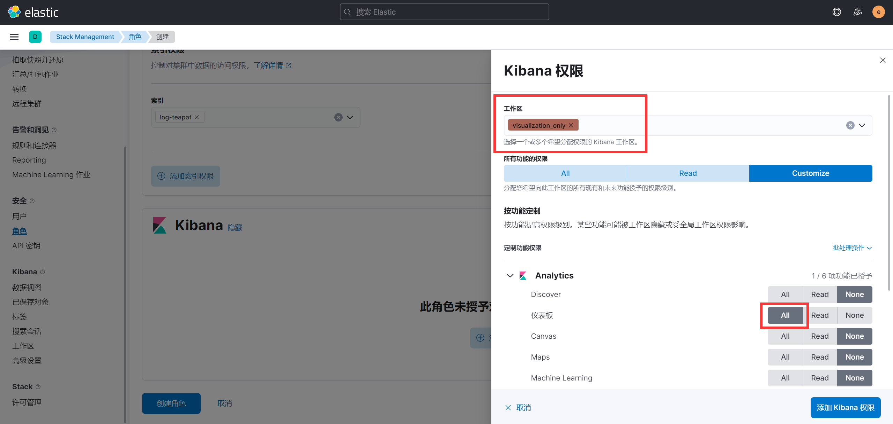
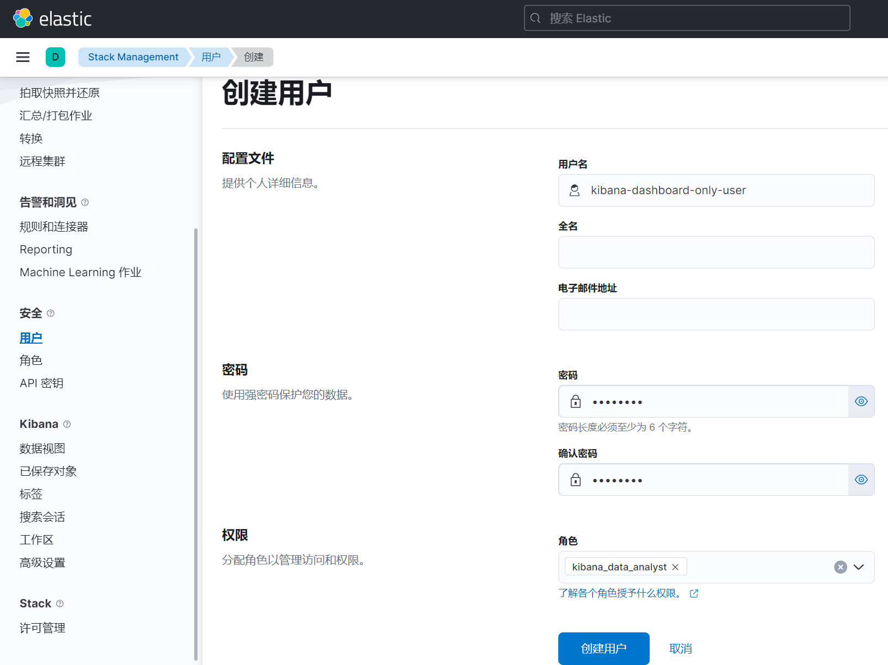

### 创建 Space

前往 Stack Management -> Spaces 创建一个空间

本例中创建的样式如图所示


### 创建 Dashboard

切换至新建的 Space （方法如下图）并创建一个 Dashboard


创建好后，复制地址栏中形如 `/app/dashboard#/view/xxxxx` 的这段地址备用

本例中的复制的内容如下所示

```plain
/app/dashboards#/view/04d2e130-fc13-11ec-ae61-a383e01a8fec?_g=(filters:!(),refreshInterval:(pause:!t,value:0),time:(from:now-15m,to:now))
```


### 设置路由

前往 Stack Management -> Advanced Settings -> Default Route

将上一小节中复制的内容粘贴至此处以设定默认路由地址，填入内容后，记得保存页面设置

如果设置无误，每次打开该 Space 时，即会自动跳转至该 Dashboard

### 创建 Role

前往 Stack Management -> Role 创建一个角色

设定好 Role name 和 Index privileges（选择能够访问的索引并赋予 Read 权限）

赋予其 Kibana 权限，本例中的设置如下所示



### 创建用户

前往 Stack Management -> Users 创建一个用户

本例中设置的用户如图所示




### 修改配置文件

修改 `docker-compose.yml` 文件，在 Kibana 的 `volumes` 部分加入如下内容

```yaml
- ./kibana.yml:/usr/share/kibana/config/kibana.yml
```


新建文件 `kibana.yml`，并在其中配置如下内容：


```yaml
# 以 Docker 方式配置的默认设置
server.host: "0.0.0.0"
server.shutdownTimeout: "5s"
elasticsearch.hosts: [ "http://elasticsearch:9200" ]
monitoring.ui.container.elasticsearch.enabled: true

# 修改显示语言为中文
i18n.locale: "zh-CN"

# 配置默认登录用户
xpack.security.authc.providers:
  anonymous.anonymous1:
    order: 1
    credentials:
      username: "kibana-dashboard-only-user"
      password: "password"
  basic.basic1:
    order: 2
```

修改完配置文件后，重启 Kibana，进入 Dashboard 页面，选择 Share 功能，即可复制 Public URL

*该功能在 Chrome 上工作不正常，Firefox 没有问题*


### 参考连接
1. [Authentication in Kibana - Kibana Guide [8.3] - Elastic](https://www.elastic.co/guide/en/kibana/current/kibana-authentication.html#anonymous-authentication)
1. [Embed Kibana content in a web page - Kibana Guide [8.3] - Elastic](https://www.elastic.co/guide/en/kibana/current/embedding.html)
1. [Share Public URL Option Not Present - Elastic Stack / Kibana - Discuss the Elastic Stack](https://discuss.elastic.co/t/share-public-url-option-not-present/266843)
1. [Configure Kibana - Kibana Guide [8.3] - Elastic](https://www.elastic.co/guide/en/kibana/current/settings.html)
1. [Install Kibana with Docker - Kibana Guide [8.3] - Elastic](https://www.elastic.co/guide/en/kibana/current/docker.html#docker-bind-mount-config)
1. [Kibana：如何让用户匿名访问 Kibana 中的 Dashboard_Elastic 中国社区官方博客的博客-CSDN博客_kibana 匿名登录](https://blog.csdn.net/UbuntuTouch/article/details/118152293)
1. [Security settings in Kibana - Kibana Guide [8.3] - Elastic](https://www.elastic.co/guide/en/kibana/current/security-settings-kb.html#xpack-security-sameSiteCookies)