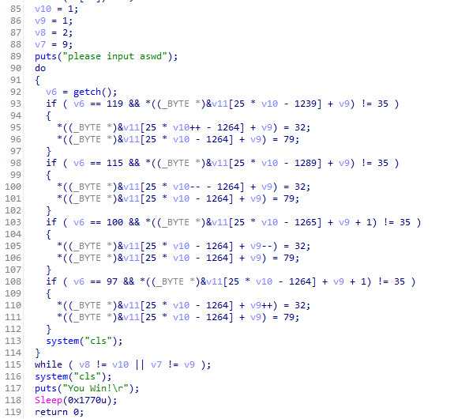

# 原始文件

【[re1.exe](/assets/2022/reverse/ex01/re1.exe)】

MD5：`46F8553C1FE1F88F927F4037C6FC7771`
SHA-1：`FAEA9FB20B436CEAE05E3A6C01FE7D21D5ECB7D4`

<!-- more -->

# 逆向过程

## 运行文件


运行后可见是一个命令行程序，提示输入 aswd 作为密码，猜测此题应该为一个平面迷宫题，且 flag 应为一个 aswd 组成的字符串。

在任意输入后，终端被清空，猜测仅当输入正确后才会有进一步的回显。

## 使用 Exeinfo PE 查看文件信息


可见程序是一个 64 位的可执行文件，似乎是用 MinGW 编译，未加壳。

## 使用 IDA Pro 打开文件

先用 <kbd>Shift</kbd> + <kbd>F12</kbd> 打开字符串窗口，没能找到除了有价值的信息

回到 IDA View，找到 main 函数，按下 <kbd>F5</kbd> 生成伪代码

先看代码中的主要逻辑部分，即下图中的第 90 行至第 115 行



这部分主要是一个 do-while 循环，只有满足**循环终止条件**后，才会输出“You Win!”，即我们需要的 flag

可得现在的首要目标是去满足**循环终止条件**，进一步分析循环终止条件，应当是【`v8` 等于 `v10` **且** `v7` 等于 `v9`】时，循环终止。而 `v8` 和 `v7` 在图中的第 87 行和第 88 行出现后之后就未有过变动，所以可以进一步分析得循环的终止条件应该是【`v10` 等于 2 **且** `v9` 等于 9】

再看循环体部分，`v6` 是用户输入的单个字符，再看每个 if 语句的**第一个条件**，四个 if 语句的第一个条件根据 ASCII 码转换来分别是 <kbd>w</kbd>（119）、<kbd>s</kbd>（115）、<kbd>d</kbd>（100）、<kbd>a</kbd>（97），即根据用户输入的“上下左右”来进行对应的操作，至此基本可以确定该题是一个平面迷宫了。

继续分析剩余部分的伪代码，将赋值给 `v4` 的值


全部转换为字符


这下就比较明显了，但每一行有形如 `v4[0]` 和 `v4[1]` 两组有效字符，是否拼接和如何拼接便成了新的问题。

先尝试将 `v4[0]` 等每一行拼接成一幅字符画：将 `O` 视作角色所在位置，将 `#` 视作迷宫的“墙壁”，空白之处即为通向出口的路径。

```text
######O#
###### #
#####  #
   ## ##
## ##  #
## ### #
##     #
########
```

此时，已经可以比较容易明白循环体中四个 if 语句的第二个条件：目标位置不为“墙壁”。而每个 if 的条件代码，第一行均为“在用户移动后将上一个位置变为空格”，第二行均为“移动后的所在位置替换为 O”

运行程序，尝试 `ssassdssaaaawwwaa`，程序没有反应，根据前面的分析，如果结果正确，将会出现“You Win!”的提示

尝试拼接一下字符串，按顺序拼接上 `v4[0]` 和 `v4[1]`，得到如下图形

```text
##########
######O###
###### #  
#####  ## 
   ## ### 
## ##  ###
## ### ###
##     ###
##########
##########
```

好像不对，尝试调换一下顺序，将 `v4[1]` 放在 `v4[0]` 之前

```text
##########
########O#
  ###### #
# #####  #
#    ## ##
#### ##  #
#### ### #
####     #
##########
##########
```

得出一个 10 行 10 列的图形，且明显能看出是个完整的平面迷宫

再次运行程序，尝试 `ssassdssaaaawwwaaawwa`

但是程序仍然没有回显，问题出在哪里呢？

 

再重新结合逻辑代码开始分析

循环的终止条件是【`v10` 等于 2 且 `v9` 等于 9】，这个终止条件应该就是迷宫的出口，放到二维平面上看应该就是出口的坐标 `(2,9)`

结合伪代码中的 `v10` 和 `v9` 两个变量以及二维迷宫图像，可以得出起点的坐标应为 `(1,1)`

通过上述两个坐标可以判断出，这个坐标系的原点 `(0,0)` 应该是图像的右上角

如此，关于平面图象上的移动，可做出如下推论：
- 向下移动，纵坐标增加
- 向上移动，纵坐标减少
- 向左移动，横坐标增加
- 向右移动，横坐标减少

再结合逻辑代码中使用 `(v9,v10)` 两个变量来表示坐标，观察其在代码中的增减：
- 输入 <kbd>w</kbd>，`v10` 增加 1，即纵坐标增加
- 输入 <kbd>s</kbd>，`v10` 减少 1，即纵坐标减少
- 输入 <kbd>a</kbd>，`v9` 增加 1，即横坐标增加
- 输入 <kbd>d</kbd>，`v9` 减少 1，即横坐标减少

把上述二者一结合，就能发现正确答案了：
- <kbd>w</kbd> 向下移动
- <kbd>s</kbd> 向上移动
- <kbd>a</kbd> 向左移动
- <kbd>d</kbd> 向右移动

 

原来是 <kbd>w</kbd> 和 <kbd>s</kbd> 与常识相反

再次运行程序，尝试 `wwawwdwwaaaasssaaassa`，即可解出正确答案


