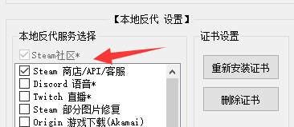
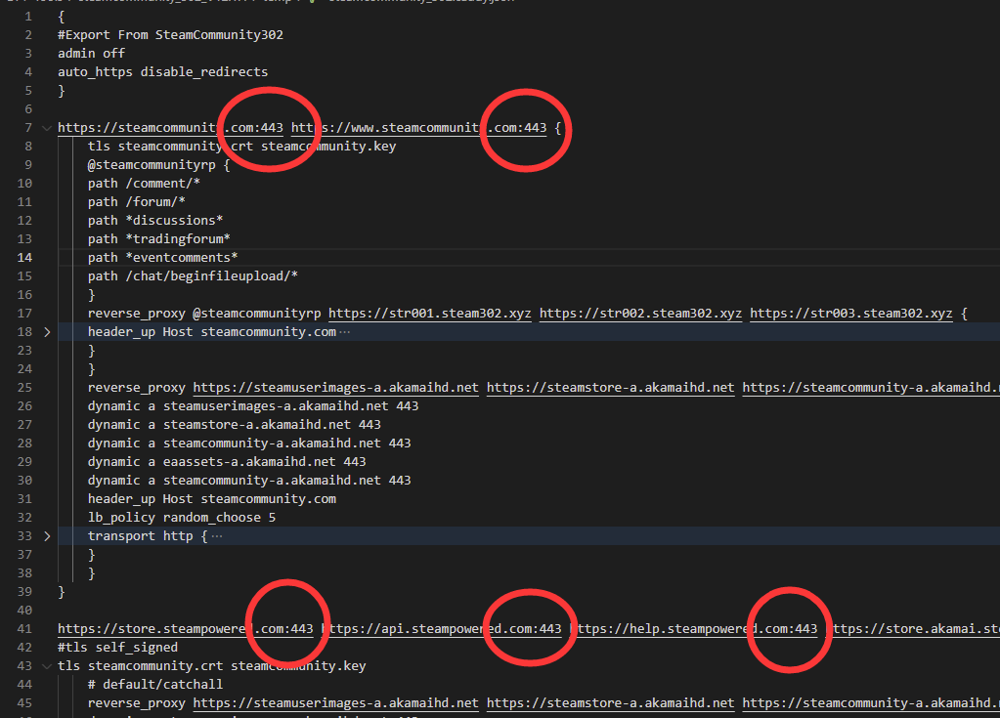

由于一些众所周知原因，Steam 社区页面无法在我所处的地区直接访问了，而我部署于 Linux 设备上的 ArchiSteamFarm 也因此无法正常工作。早些时候是通过使用网络代理的方式来使其正常工作的，但该方法稳定性不够理想，故试图使用 caddy 进行本地反代的方式来解决问题。

## 准备工作

- 一台 Debian 系的设备（Ubuntu 和 Raspbian 测试通过）
  - 需要 root 权限
  - 需要占用 443 端口
- Steamcommunity 302（[官方下载地址](https://www.dogfight360.com/blog/686/)，本文使用 `V12.1.4` 版本）
- caddy（[caddy 的 Releases 页](https://github.com/caddyserver/caddy/releases/),本文使用 `v2.6.2` 版本）
  - 如使用树莓派，请下载 `armv5` 版本

## 1 在 Windows 上生成证书

在 Windows 设备上正常下载并使用 Steamcommunity 302 软件，在其设置内勾选自己所需反代的服务。

在本例中，勾选了 Steam 社区和商店。



运行一次并确认工作正常后，应当会在 Steamcommunity 302 目录下，生成自签证书等多个文件。

## 2 修改文件并发送至 Linux 设备

本步骤共需要 6 个文件，建议先将下列文件复制一份以供后续编辑操作。

```
steamcommunityCA.pem
steamcommunityCA.key
steamcommunity.key
steamcommunity.crt
steamcommunity_302.caddy.json
caddy
```

编辑 `steamcommunity_302.caddy.json` 文件，将红圈处原先随机生成的端口修改为 443 端口。



如果在 Steamcommunity 302 中选择反代了多个服务，并且希望在 Linux 设备上使用，那么需要修改的数量会多于图中的红圈，请仔细检查并修改该文件。

## 3 导入证书

将上一步骤中的 6 个文件传递到 Linux 服务器上。

注意，在 Debian/Ubuntu 系的服务器上，需要将 `steamcommunityCA.pem` 修改为 `.crt` 扩展名，才可在后续步骤中正常导入。

故运行如下命令：

```
sudo cp steamcommunityCA.pem /usr/local/share/ca-certificates/steamcommunityCA.crt
```

并使用如下命令更新根证书：

```
sudo update-ca-certificates
```

若一切正常，将会看到提示添加了 1 张新证书。

## 4 修改 hosts

在 Windows 上，打开 `C:\Windows\System32\drivers\etc` 并打开 `hosts` 文件。

复制 `hosts` 文件中，以 `#S302` 结尾的条目。

将上述复制的内容写入到 Linux 设备上的 `/etc/hosts` 文件中。

在本例中，写入了如下内容：

```
127.0.0.1 steamcommunity.com #S302
127.0.0.1 www.steamcommunity.com #S302
127.0.0.1 store.steampowered.com #S302
127.0.0.1 api.steampowered.com #S302
127.0.0.1 help.steampowered.com #S302
127.0.0.1 store.akamai.steamstatic.com #S302
```

请根据实际情况调整。

## 5 运行 caddy 并测试

进入 caddy 目录，赋予 caddy 执行权限，然后启动：

```sh
chmod +x caddy
sudo ./caddy run --config steamcommunity_302.caddy.json --adapter caddyfile
```

因为使用了 443 端口，故需要 root 权限以运行。

如若运行正常，可进行测试，例如使用 `curl https://steamcommunity.com/` 或直接启动 ASF 等程序进行测试。

## 6 配置开机自启动

本例供树莓派官方系统配置开机自启动参考，编辑 `/etc/rc.local` 文件，加入如下内容：

```
su pi -c 'screen -dmS caddy'
su pi -c 'screen -S caddy -X stuff "cd /home/pi/caddy && sudo ./caddy run --config steamcommunity_302.caddy.json --adapter caddyfile\n"'
```

注意：
1. 请根据实际，更改命令中自己所使用的用户名以及第二行命令中 caddy 的路径。
1. 添加上述两行的位置，亦请根据实际调整。
1. 需要 `screen` 命令支持

## 参考资料

1. [Linux/Macos环境下使用 steamcommunity 302 教程 – Dogfight360](https://www.dogfight360.com/blog/2319/)
1. [How do you add a certificate authority (CA) to Ubuntu? - Super User](https://superuser.com/questions/437330/how-do-you-add-a-certificate-authority-ca-to-ubuntu)
1. [从Steam社区屏蔽分析绕过方法及ASF安全部署 - NiGhT_Ray - 博客园](https://www.cnblogs.com/night-ray/articles/15964334.html)